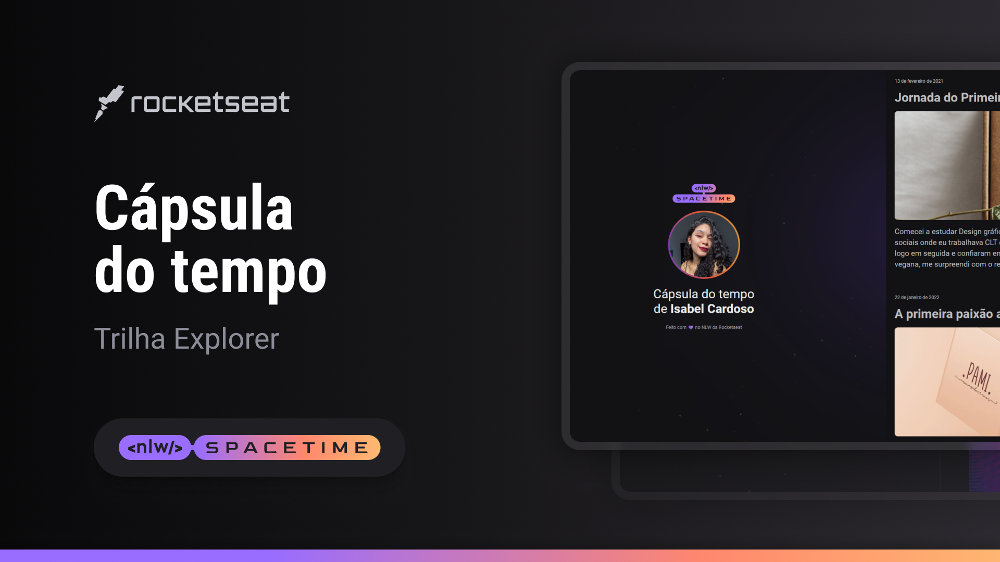

## 🖥️ Projeto

Esse é um projeto web responsivo de uma capsula para exibir memórias em uma linha do tempo.

## 🚀 Tecnologias

Esse projeto foi desenvolvido durante o NLWS da Rocketseat com as seguintes tecnologias:

- HTML
- CSS
- Git e Github

## 🏷️ Layout

Você pode visualizar o layout do projeto através [desse link] (https://www.figma.com/file/n0A1jmZ4clQVx70L2j3R06/C%C3%A1psula-do-tempo-%E2%80%A2-Isabel?type=design&node-id=306%3A84&t=jwCyJI3ykZRWDOm0-1). 
É necessário ter uma conta no figma. [Figma] (https://www.figma.com)
